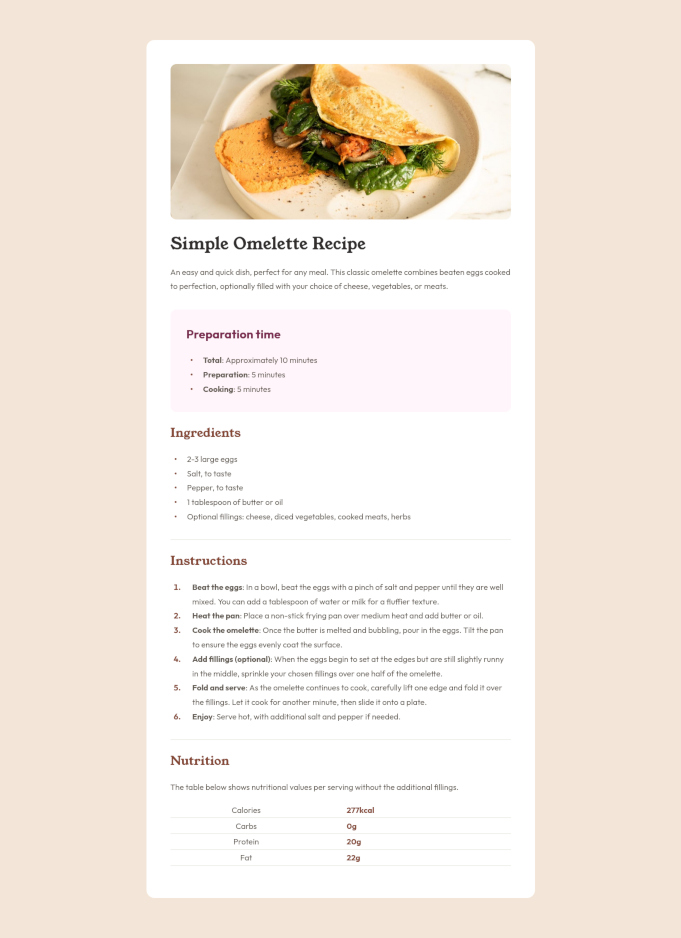

# Recipe page

This is a solution to the [Recipe page challenge on Frontend Mentor](https://www.frontendmentor.io/challenges/recipe-page-KiTsR8QQKm).

## Screenshot




## Links

- [Live Site URL](https://toanrb.github.io/frontend-challenges/recipe-page)
- [Solution URL](https://github.com/toanrb/frontend-challenges/tree/master/recipe-page)

## Built with

- Mobile first approach
- BEM naming convention

## What I learned

- [`li::marker` pseudo-element](https://developer.mozilla.org/en-US/docs/Web/CSS/::marker)
- Customize list marker using `::before` pseudo-element
- To be able to set `border-bottom` to table rows, we must collapse the table's borders first

```css
.recipe table {
  border-collapse: collapse;
}

.recipe table tr {
  border-bottom: 1px solid var(--stone-150);
}
```

## Useful resources

- [CSS Tricks: Everything You Need to Know About the Gap After the List Marker](https://css-tricks.com/everything-you-need-to-know-about-the-gap-after-the-list-marker/)
