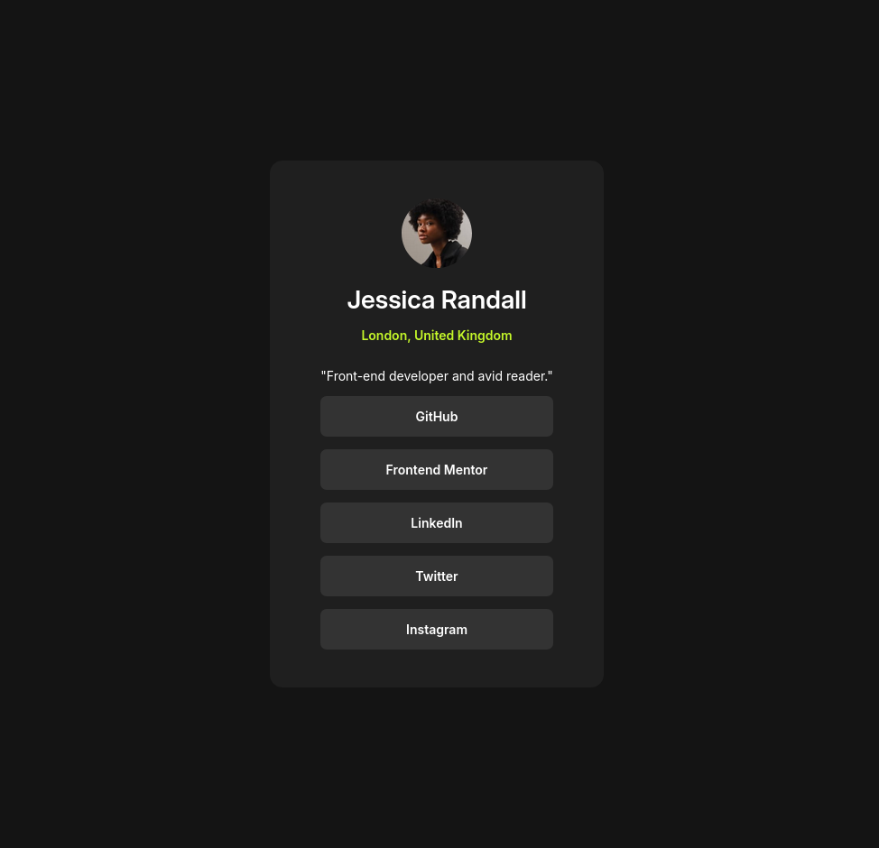

# Social links profile

This is a solution to the [Social links profile challenge on Frontend Mentor](https://www.frontendmentor.io/challenges/social-links-profile-UG32l9m6dQ).

## Screenshot

### Links

- [Live Site URL](https://toanrb.github.io/frontend-challenges/social-links-profile)
- [Solution URL](https://github.com/toanrb/frontend-challenges/tree/social-links-profile)

## What I learned

BEM naming convention

## Useful resources

[Freecodecamp: CSS Naming Conventions that Will Save You Hours of Debugging](https://www.freecodecamp.org/news/css-naming-conventions-that-will-save-you-hours-of-debugging-35cea737d849/)

